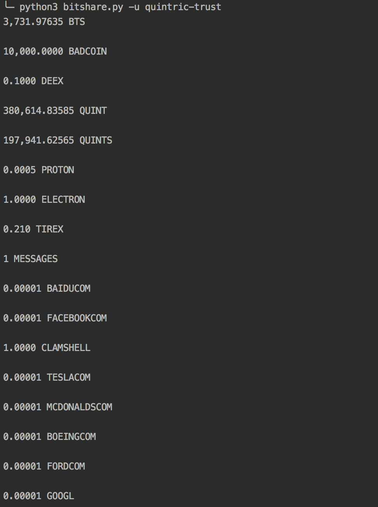

# quintric_coding_challenge

[](https://app.codacy.com/app/2Clutch/quintric_coding_challenge?utm_source=github.com&utm_medium=referral&utm_content=2Clutch/quintric_coding_challenge&utm_campaign=badger)
[](https://stackshare.io/2Clutch/knowledge-purse)

This project is a simple command line application which can be used to view the balances of any given BitShare users.

# Setup

First, you will want to clone the repository using the following command:
```commandline
git clone https://github.com/2Clutch/quintric_coding_challenge
```

To interact with the blockchain, I used [pybitshares](http://docs.pybitshares.com/en/latest/index.html). According to their documentation, there are 2 ways to install the library. I went with `pip3`, running:
```commandline
sudo apt-get install libffi-dev libssl-dev python-dev python3-dev python3-pip
pip3 install bitshares
```

Just for clarification, each line above represents a command to be ran independently. Once that's taken care of, navigate to the project's directory and run:
```commandline
python3 bitshares.py -u [insert_user_name_here]
```

<br>


